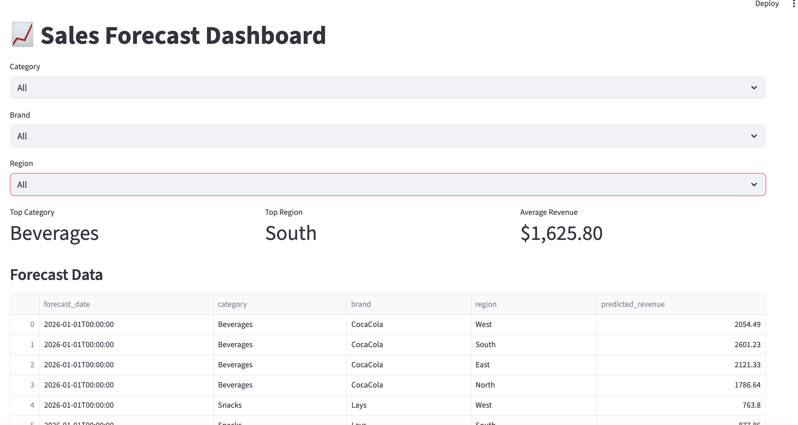

# Sales Forecasting Platform

## Overview

This project is an end-to-end sales forecasting platform that demonstrates modern data engineering, machine learning, API development, dashboarding, AI integration, containerization, testing, and continuous integration practices.

The solution ingests transactional sales data, enriches it with product and store reference data, performs data quality validation, generates future revenue forecasts using machine learning, and provides AI-powered business insights through an interactive dashboard.

## Dashbaord



---

## Key Capabilities

* Multi-source data ingestion
* Data quality validation and rejection handling
* Product and store master data enrichment
* Machine learning-based revenue forecasting
* AI-generated business insights
* Interactive analytics dashboard
* Containerized deployment
* Automated testing and Continuous Integration

---

## Architecture

```text
Sales Transactions      Product Master      Store Reference
       |                      |                    |
       +----------------------+--------------------+
                              |
                              v
                    Bronze Layer (Raw Data)
                              |
                              v
                   Silver Layer (Validated Data)
                              |
                              v
                    Feature Engineering
                              |
                              v
                 Random Forest Forecasting
                              |
                              v
                     Forecast Generation
                              |
                              v
                         FastAPI APIs
                              |
                              v
                    Streamlit Dashboard
                              |
                              v
                   DeepSeek LLM Insights
```

---

## Data Sources

### Sales Transactions

Contains transactional sales events.

| Column         | Description                   |
| -------------- | ----------------------------- |
| transaction_id | Unique transaction identifier |
| date           | Transaction date              |
| sku            | Product SKU                   |
| store_id       | Store identifier              |
| quantity       | Units sold                    |
| price          | Unit price                    |

### Product Master

Contains product reference information.

| Column       | Description          |
| ------------ | -------------------- |
| sku          | Product SKU          |
| category     | Product category     |
| brand        | Product brand        |
| package_size | Product package size |
| list_price   | Product list price   |
| launch_date  | Product launch date  |

### Store Reference

Contains store and regional information.

| Column              | Description                  |
| ------------------- | ---------------------------- |
| store_id            | Store identifier             |
| store_name          | Store name                   |
| region              | Geographic region            |
| demographic_segment | Customer demographic segment |

---

## Data Pipeline

### Bronze Layer

The Bronze layer stores raw ingested datasets exactly as received from source systems.

Responsibilities:

* Raw data ingestion
* Schema validation
* Source lineage tracking
* Data preservation

### Silver Layer

The Silver layer stores validated and enriched datasets.

Implemented validations:

* Null value validation
* Invalid date detection
* Duplicate transaction removal
* Negative quantity rejection
* Negative price rejection
* Unknown SKU rejection
* Unknown Store rejection

Enrichment:

* Sales Transactions + Product Master
* Sales Transactions + Store Reference

Derived fields:

* Revenue

---

## Forecasting Approach

### Model

The forecasting solution uses:

```text
RandomForestRegressor
```

### Features

Forecasts are generated using:

* Category
* Brand
* Region
* Month
* Day of Week

### Training Data

Historical demand patterns are generated from validated transactional data and enriched with:

* Product attributes
* Regional demand characteristics
* Seasonal demand variations

### Output

The model generates 30-day revenue forecasts across category, brand, and region combinations.

---

## AI-Powered Insights

The platform integrates with the DeepSeek API to generate business-friendly insights.

Process:

```text
Forecast Results
       ↓
Summary Metrics
       ↓
DeepSeek LLM
       ↓
Business Insights
```

Examples include:

* Revenue trend analysis
* Top-performing categories
* Top-performing brands
* Regional performance summaries

---

## Project Structure

```text
sales-forecast/

├── data/
│   └── raw/

├── data_lake/
│   ├── bronze/
│   └── silver/

├── docs/
│   └── adr/
│       └── 001-architecture.md

├── ml/
│   ├── artifacts/
│   ├── predictions/
│   └── training_sales.parquet

├── src/
│   ├── ingestion/
│   ├── forecasting/
│   ├── api/
│   ├── llm/
│   └── ui/

├── tests/
│   └── test_api.py

├── .github/
│   └── workflows/
│       └── ci.yml

├── Dockerfile.fastapi
├── Dockerfile.streamlit
├── docker-compose.yml
├── requirements.txt
└── README.md
```

---

## Running Locally

### Prerequisites

* Python 3.9
* Git
* Docker (optional)

### Install Dependencies

```bash
pip install -r requirements.txt
```

### Execute Data Pipeline

```bash
python src/ingestion/load_data.py

python src/forecasting/generate_training_data.py

python src/forecasting/train_model.py

python src/forecasting/predict.py
```

## Environment Variables

Create a `.env` file:

DEEPSEEK_API_KEY=<your_key>

### Start FastAPI

```bash
uvicorn src.api.main:app --reload
```

Swagger UI:

```text
http://127.0.0.1:8000/docs
```

### Start Streamlit

```bash
streamlit run src/ui/app.py
```

---

## Docker Deployment

Build and start the application:

```bash
docker compose up --build
```

Application URLs:

```text
FastAPI   : http://localhost:8000
Swagger   : http://localhost:8000/docs
Streamlit : http://localhost:8501
```

---

## API Endpoints

| Method | Endpoint    | Description                             |
| ------ | ----------- | --------------------------------------- |
| GET    | /health     | Application health check                |
| GET    | /forecast   | Revenue forecasts with optional filters |
| GET    | /summary    | Forecast summary metrics                |
| GET    | /categories | Available categories                    |
| GET    | /brands     | Available brands                        |
| GET    | /regions    | Available regions                       |
| POST   | /insights   | AI-generated business insights          |

### Forecast Filters

Supported query parameters:

* category
* brand
* region

Example:

```http
GET /forecast?category=Beverages&brand=CocaCola&region=South
```

---

## Testing

Run tests using:

```bash
pytest
```

The test suite validates:

* API functionality
* Forecast endpoint behavior
* Application health checks

---

## Continuous Integration

GitHub Actions is used to automatically execute tests on:

* Push events
* Pull requests

Benefits:

* Automated validation
* Early issue detection
* Improved code quality

---

## Architecture Decision Records

Architecture decisions are documented in:

```text
docs/adr/001-architecture.md
```

The ADR captures the architectural decisions, rationale, trade-offs, and consequences behind the design of the platform.

---

## Future Enhancements

Potential extensions include:

* Gold-layer business aggregations
* Advanced forecasting models (XGBoost, Prophet, LSTM)
* Promotion and marketing campaign signals
* Weather data integration
* Real-time streaming ingestion
* Cloud-native deployment
* Continuous Deployment (CD) pipelines

---
